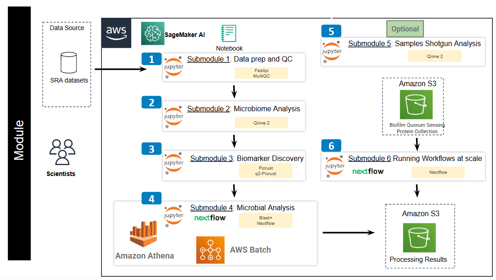

## **Contents**

- [Getting Started](#getting-started)
- [Workflow Diagrams](#workflow-diagrams)

## **Getting Started**

This repository contains several notebook files which serve as metagenomics analysis of biofilm microbiome workflow tutorials.

The below steps guide you through setting up a notebook instance on Amazon SageMaker AI, downloading our tutorial files, and running those files. 

Accordingly, before starting, make sure you have an Amazon account and have access to it.

Once you have these, you can begin by first navigating to https://aws.amazon.com/ and logging in with your credentials. Then, in the top left of the screen, search for 'SageMaker AI'.

This tutorial will cost you less than $10.00 assuming a ml.m5.xlarge notebook instance (except running submodule 5 which is costly), and assuming you delete the notebook and the storage bucket after you finish the tutorial.

### Creating a notebook instance 

Follow the steps highlighted [here](https://github.com/NIGMS/NIGMS-Sandbox/blob/main/docs/HowToCreateAWSSagemakerNotebooks.md) to create a new notebook instance in Amazon SageMaker. 

### Notebook Creation:

+ In step 4, select ml.m5.xlarge from the dropdown box as the notebook instance type and be especially careful to **enable idle shutdown**.

+ In step 7, after creating a notebook instance and being in JupyterLab screen you will need to download the module content. The easiest way to do this is to clone the repository directly for the NIGMS Github. This can be done by clicking on git symbol in your JupyterLab environment and pasting the following URL `https://github.com/NIGMS/Metagenomics-Analysis-of-Biofilm-Microbiome.git`. This should download our repo, and the tutorial files inside, into a folder called 'Metagenomics-Analysis-of-Biofilm-Microbiome'.

+ When you are finished running code, stop your notebook to prevent unneeded billing as illustrated in step 9.

### Notebook Creation for submodule 5 (Optional):

+ In step 4, select ml.m5.12xlarge from the dropdown box as the notebook instance type and increase the volume size to 300 GB. Be especially careful to **enable idle shutdown**.

## **Architecture Design**

The image below describes the cloud implementation of our analytic workflow. We will download sequence datasets and databases to our SageMaker AI notebook, use the tools to run the analysis, then copy the outputs to an Amazon S3 bucket.

  

