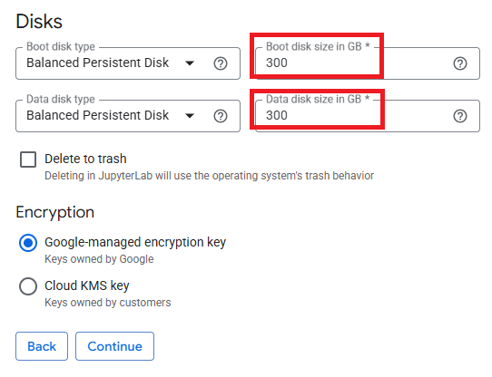
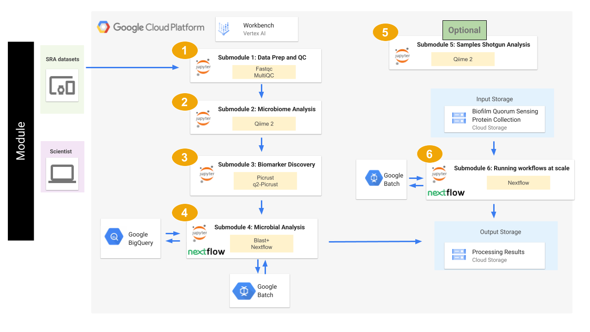

## **Contents**

- [Getting Started](#getting-started)
- [Workflow Diagrams](#workflow-diagrams)

## **Getting Started**

This repository contains several notebook files which serve as bioinformatics workflow tutorials.

The below steps guide you through setting up a virtual machine on Google Cloud Platform, downloading our tutorial files, and running those files. 

Accordingly, before starting, make sure you have a google account and have access to a Google Cloud Platform Project.

Once you have these, you can begin by first navigating to https://console.cloud.google.com/ and logging in with your credentials. Then, in the top left of the screen, navigate to 'select a project', and choose the project you belong to.

This tutorial will cost you less than $10.00 assuming a n1-standard-4 machine (except running submodule 5 which is costly), and assuming you delete the virtual machine and the storage bucket after you finish the tutorial.

### Creating a user managed notebook 

* **Python Kernel:** Follow the steps highlighted [here](https://github.com/NIGMS/NIGMS-Sandbox/blob/main/docs/HowToCreateVertexAINotebooks.md) to create a new notebook instance in Vertex AI. Follow steps 1-8 and be especially careful to enable idle shutdown as highlighted in step 8. In step 7 in the Machine type tab, select n1-standard-4 from the dropdown box.

To clone this repository, use the Git command `git clone https://github.com/NIGMS/RNA-Seq-Differential-Expression-Analysis.git` in the dropdown menu option in Jupyter notebook. Please make sure you only enter the link for the repository that you want to clone. There are other bioinformatics related learning modules available in the [NIGMS Repository](https://github.com/NIGMS). This should download our repo, and the tutorial files inside, into a folder called 'RNA-Seq-Differential-Expression-Analysis'. Double click this folder now. Inside you will find all our tutorial files, which you can double click and run.

### Creating a user managed notebook for submodule 5 (Optional): 

* **Python Kernel:** Follow the steps highlighted [here](https://github.com/NIGMS/NIGMS-Sandbox/blob/main/docs/HowToCreateVertexAINotebooks.md) to create a new notebook instance in Vertex AI. Follow steps 1-8 and be especially careful to enable idle shutdown as highlighted in step 8. In step 7 in the Machine type tab, select n1-standard-32 from the dropdown box and increase data disk size to 300 GB.

  

### Stopping Your Virtual Machine

When you are finished running code, you can turn off your virtual machine to prevent unneeded billing or resource use by checking your notebook and pushing the **Stop** button.

## **Architecture Design**

The image below describes the cloud implementation of our analytic workflow. We will download sequence datasets and databases to our Vertex AI Workbench notebook, use tools to run the analysis, then copy the outputs to a Cloud Storage bucket.

  

