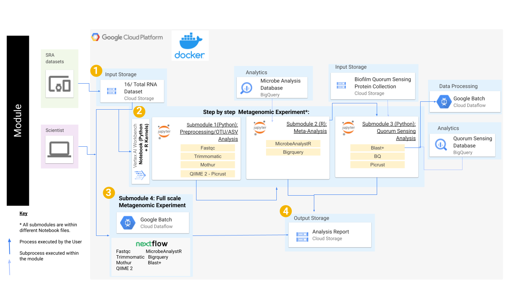

## Contents

- [Getting Started](#getting-started)
- [Workflow Diagrams](#workflow-diagrams)

## **Getting Started**

Follow the steps highlighted [here](https://github.com/STRIDES/NIHCloudLabGCP/blob/main/docs/vertexai.md) to create a new user-managed notebook in Vertex AI. Follow steps 1-8 and be especially careful to enable idle shutdown as highlighted in step 7. In step 5 click the **Environment** drop down menu, select **'Custom container'**. A new field will pop up that says 'Docker container image'. Type in the following Docker container `us-east4-docker.pkg.dev/nih-cl-shared-resources/nigms-sandbox/metagenomic-pipeline@sha256:8f77cb07b0ffdddcfbf15018e60facd009dcb684bc5bca47b98928125efaa821` then click **CONTINUE** at the bottom. In step 6 in the Machine type tab, select n1-standard-8 from the dropdown box. 

After creating your Vertex AI notebook from custom Docker image metagenomic-pipeline:
- Open Jupyter Lab
- Open the terminal: Ctrl + Shift + L -> Other -> Terminal
- Clone the our repo using the command `git clone https://github.com/NIGMS/Metagenomics-Analysis-of-Biofilm-Microbiome.git`

## **Architecture Design**

The image below describes the cloud implementation of our analytic workflow. We will download sequence datasets and databases to our Vertex AI virtual machine, use custom kernels to run the analysis, then copy the outputs to a Cloud Storage bucket.

