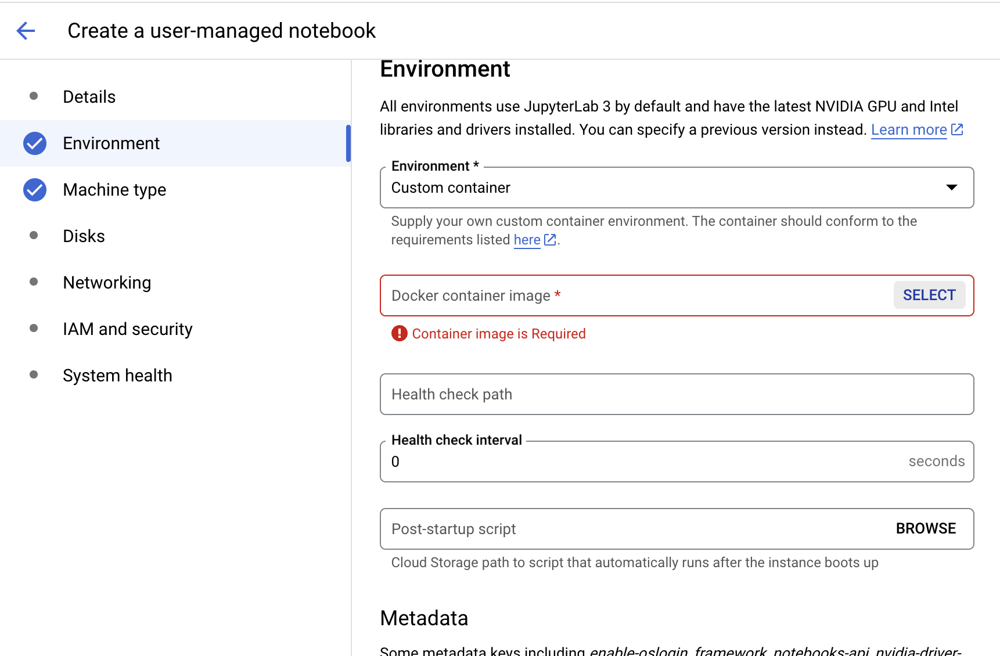

# University of South Dakota Dockerized Analysis of Microbial Community and Biofilms 
---------------------------------

## Contents

- [Overview](#OV)
- [Learning Objectives](#LOS)
- [Getting Started](#GS)
- [Software Requirements](#SOF)
- [Workflow Diagrams](#WORK)
    + [Submodule 0 (Python): Introduction - Concept Inventory and Workflow Overview](#LSM0)
    + [Submodule 1 (Python) - Metagenome data preparation and QC](#LSM1)
    + [Submodule 2 (Python, BASH) - Microbiome Analysis](#LSM2)
    + [Submodule 3 (Python, BASH, R) - Biomarker Discovery](#LSM3)
    + [Submodule 4 (Python, BASH) - Microbial Community Analysis](#LSM4)
    + [Submodule 5 (Python, BASH) - Running workflows at scale with Google Life Sciences API](#LSM5)
- [Data](#DATA)
- [Troubleshooting](#TR)
- [Funding](#FUND)
- [License for Data](#LIC) 

---


## **Overview** <a name="OV"></a>
> INSTRUCTIONS: This README should walk the learner through the background and steps necessary to complete this training module. To use our module, clone this repo using `git clone https://github.com/NIGMS/MetagenomicsUSD` and then navigate to the directory for this project. For more technical details of the cloud, see the [NIH Cloud Lab README](https://github.com/STRIDES/NIHCloudLabGCP).

A microbial community and biofilms are complex formations of microbials in collaborative groups, composed of different types of microorganisms such as bacteria, viruses and fungi. This tutorial aims to introduce the learner to microbiome analysis through a self-paced practical learning module that will aid in the understanding of the role of biofilms in human health and beyond. This will include the analysis of the microbial community composition (what microorganism is in my sample?), diversity, and function (what are they doing?). We will leverage quorum sensing protein signatures to provide insights into the microbial community and biofilm gene-phenotype response markers prediction.

This README describes the tutorials in our step-by-step analytic workflow. These submodules cover the end-to-end workflow of a standard metagenomics  bioinformatics analysis, starting at core dataset preparation (e.g., downloading raw sequence data) through microbial community gene/function marker prediction.

This module will cost about $8.00 to run, assuming you shut down and delete all resources when you are finished.

Watch this [Introduction Video](https://youtu.be/MN-PgnNxqww) to learn more about the module.

<div class="alert alert-block alert-info">
    <i class="fa fa-lightbulb-o" aria-hidden="true"></i>
    <b>Tip: </b> This module uses Docker. If you have any docker related issue, refer to our troubleshooting section below or contact us. 
</div>


---
## **Learning Objectives:** <a name="LOS"></a>
The biofilm metagenomics workflow self-learning module will serve for undergraduate through graduate level. The learning objectives vary slightly based on the audience. This Docker version will help users to achieve 2 learning objectives (LOs):

LO1. Concepts Inventory
 > Statement 1: The learner will learn fundamental concepts related to microbiome and biofilm analysis. Biofilms have great importance for public health because of their role in certain infectious diseases and importance in a variety of device-related infections.

LO2 - Dataset and Toolkits 
> Statement 1: The learner will be able to describe and manipulate datasets and toolkits relevant to microbiome analysis projects. Biofilm metagenomic analysis can be leveraged to aid in our understanding of microbial taxonomy, functions, interactions, ecology, and evolution.


The course consists of 5 learning submodules:

*Submodule #0: Introduction - Concept Inventory and Workflow Overview* <br>
*Submodule #1: Metagenome Data Preparation and QC* <br>
*Submodule #2: Microbiome Analysis* <br>
*Submodule #3: Biomarker Discovery* <br>
*Submodule #4: Microbiome Community Analysis* <br>
*Submodule #5: Running Wrkflows at Scale with Google Life Sciences API* <br> 

---


## **Getting Started** <a name="GS"></a> 
Before creating your notebook make sure you have access to GCP and have enabled the tools Big Query and Life Sciences API.
Once that is done navigate to Vertex AI, go to Workbench , USER-MANAGED NOTEBOOKS, +NEW NOTEBOOK, then click R 4.2 (or greater).
</img> <br>
Type in your notebook's name and click ADVANCE OPTIONS<br>
</img> <br>
Go to the Environment tab and click the Environment drop down menu, select **'Custom container'**.
A new field will pop up that says 'Docker container image'. Type in the following Docker container <mark> `us-east4-docker.pkg.dev/cit-oconnellka-9999/nigms-docker-repository/metagenomic-pipeline@sha256:2777ea8afbcd0f632ae7f04ebeb3a8ed21775fa3c6e9ba529046ba422bc8aaa7`</mark> then click CONTINUE at the bottom.
</img> <br> <br>
For this module we recommend the **n1-standard-8** notebook instance with 8 vCPUs, 30 GB RAM. Now you can click CREATE. <br>
</img>

After creating your Vertex AI notebook from custom Docker image metagenomic-pipeline:
- Open Jupyter Lab
- Open the terminal: Ctrl + Shift + L -> Other -> Terminal
- Clone the our repo using the command `git clone https://github.com/NIGMS/MetagenomicsUSD`


---

## **Software Requirements** <a name="SOF"></a>

Our Workflow Analytic Toolkits includes the following tools: 
- Docker
- Jupyther Notebook
- Custom Scripts
- FastQC
- MultiQC
- Trimmomatic
- QUIIME2
- Picrust2
- MicrobiomeAnalystR
- Google Big Query
- Blast+

Each dependency will be loaded at the beginning of the module and will allow the user to understand the context in which the package is relevant to our analytic process. Some will be integrated into `requirements.yaml` available in this repository. Some notebooks will require access to the Google Cloud Platform Vertex AI environment. You can install all necessary requirements using the instructions. They will generally look like this:
```
# Code install instructions
!pip install ./q2-picrust2
```


---
## **Workflow Diagrams** <a name="WORK"></a>

### Bioinformatics Workflow Diagrams

</img>

Figure 1.5. Workflow.
The metagenomics workflow includes the analysis of the biofilm composition, diversity and function. The workflow consists of 5 submodules.


### Cloud Implementation Architecture of Our Workflow
The image below describes the cloud implementation of our analytic workflow. We will download sequence datasets and databases to our Vertex AI virtual machine, use custom kernels to run the analysis, then copy the outputs to a Cloud Storage bucket.


### [Submodule 0 (Python)](./SubModule00.ipynb) - Introduction - Concept Inventory and Workflow Overview <a name="LSM0"></a>

Biofilms have great importance for public health because of their role in certain infectious diseases and importance in a variety of device-related infections.
This submodule will expose the learner to fundamental concepts of microbiome analysis.


### [Submodule 1 (Python)](./SubModule01.ipynb) - Metagenome data preparation and QC <a name= "LSM1"> </a>

<b> Step 1 - Core data Preparation:</b> 
The first step consists of identifying and downloading the project dataset and databases the rest of the submodules. 

<b> Step 2 - Raw data QC and improvement (FastQC, MultiQC):</b> 
Before analysis, we will check the dataset quality using FastQC and MultiQC.

### [Submodule 2 (Python, BASH)](./SubModule02.ipynb) - Microbiome Analysis <a name= "LSM2"> </a>

<b> Step 3 - Microbiome analysis (Qiime2):</b>
One of the primary objectives of the workflow is to characterize the taxonomic diversity of biofilm communities from 16S data using Qiime2. This step helps provide insights into the microbial diversity by identifying and associating specific organisms or taxonomic groups with phenotypic/functional traits characterizing a given environment. Taxonomic classification is challenging because the volume of metagenomics data is large and puts high demands on bioinformatic infrastructure. Additionally, queried sequences of most microbes lack taxonomically related sequences in existing references databases. **Taxonomic binning**, the process of assigning taxonomic identifiers to sequence fragments based on sequence similarity and composition, is used in draft genome reconstruction. The outcome of the binning process can then be used not only for taxonomic diversity assessment, but also leveraged for genome assembly and evaluation of gene association with different taxonomy.


### [Submodule 3 (Python, BASH, R)](./SubModule03.ipynb) - Biomarker Discovery <a name= "LSM3"> </a>

<b> Step 4 - Biomarker Discovery (PICRUSt2, q2-Picrust): </b> 
Microbiome community gene prediction and functional annotation are critical steps in the biofilm metagenomics workflow. Functional annotation of metagenomic data has become an increasingly popular method for identifying the aggregate functional capacities encoded by the community’s biofilm. This analysis relies on comparisons of predicted genes with existing, previously annotated sequences. Functional profiling provides insights into what functions are carried out by a given biofilm community.


### [Submodule 4 (Python, BASH)](./SubModule04.ipynb) - Microbial Community Analysis <a name= "LSM4"> </a>

<b> Step 5 - Microbial Comminity and Biofilm analysis (BLAST+, Google BigQuery): </b>  

The microbial community analysis relies on comparisons of predicted genes, proteins, and functions with existing previously annotated sequences. Functional profiling provides insights into what functions are carried out by a given microbial community and biofilm. Quorum sensing (QS) is one of the key indicators of a bacterial community's behavior. QS is the regulation of gene expression in response to fluctuations in cell-population density. QS bacteria produce and release chemical signaling molecules called autoinducers that increase in concentration as a function of cell density. The presence of QS signaling does not always guarantee biofilm formation, but this phenomenon has proven to be a reliable marker in several phenotype analyses of biofilms, such as those involved in cancer, dental health, medical devices, corrosion, and environmental biofilms. Here we use the STRING Database and BLAST+ to search for biofilm signatures in our metagenomic samples.


### [Submodule 5 (Python, BASH)](./SubModule05.ipynb) - Running workflows at scale with Google Life Sciences API <a name= "LSM5"> </a>

This submodule shows how to encapsulate the core concepts of microbiome community analysis into an end-to-end automated workflow that runs on a remote cloud instance. By combining Nextflow with the Google Life Sciences API, we show the user how to automate the entire pipeline. Resources are scheduled, launched, and shut down by the API so there is no need to keep track of running VMs. All output is stored in a cloud storage bucket specified in a config file. This submodule presents a great starting point for learning how to run microbiome analysis at scale with increasing data size and sample number.


---
# **Data** <a name="DATA"></a>
This training module will use 2 datasets to cover the diversity of our problem. Most of the module will use the dataset featured in [Moving pictures of the human microbiome](https://pubmed.ncbi.nlm.nih.gov/21624126/) published by Caporaso et al in 2011. For our fifth submodule that demonstrates nf-core's ampliseq workflow, we use a fecal microbiome sample, [SRR24091844](https://trace.ncbi.nlm.nih.gov/Traces/?view=run_browser&acc=SRR24091844&display=metadata).


---
# **Troubleshooting** <a name="TR"></a>

Common errors encountered in this workflow include: 
1. Missing file. This error can have multiple causes:
    - Wrong file path: Find the correct file in notebook directories, then update the correct file path.
    - File does not exist: Find path in the provided bucket or notebook and update command.
    - File was not generated: Check previous steps make sure previous step run successfully.
2. Cannot create/remove file or folder: This error can appear when you rerun the pipeline. You must usually delete the directory or the files within the output directory from processes like Qiime2.
3. Please make sure that the PICRUSt2 directory is not moved as it contains scripts whose path have been hard-coded in the containers.

---
# **Funding** <a name="FUND"></a>

>Funded by the South Dakota INBRE Program NIH/NIGMS P20 GM103443.

---
# **License for Data** <a name="LIC"></a>

All data and download files in STRING-DB are freely available under a 'Creative Commons BY 4.0' license.

Text and materials are licensed under a Creative Commons CC-BY-NC-SA license. The license allows you to copy, remix and redistribute any of our publicly available materials, under the condition that you attribute the work (details in the license) and do not make profits from it. More information is available [here](https://tilburgsciencehub.com/about/#license).

<a rel="license" href="http://creativecommons.org/licenses/by-nc-sa/4.0/"></a><br />

This work is licensed under a <a rel="license" href="http://creativecommons.org/licenses/by-nc-sa/4.0/">Creative Commons Attribution-NonCommercial-ShareAlike 4.0 International License</a>.

```python

```
